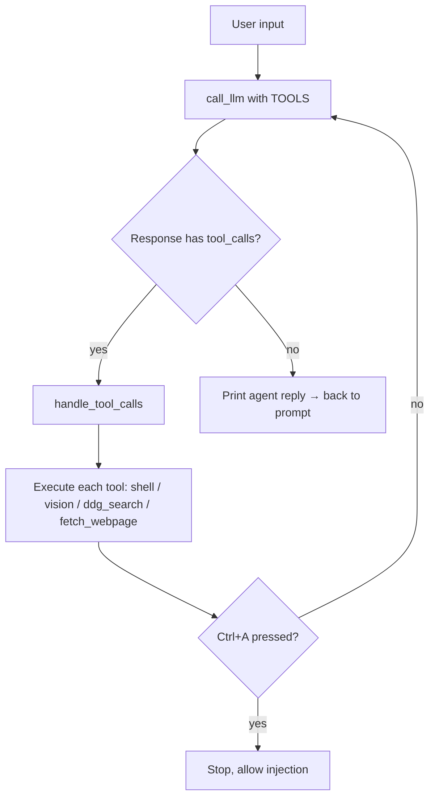

# 🧠 Micro — The AI Agent That *Really* Browses the Web

[](#prerequisites) [](LICENSE) [](#prerequisites)

> 🐧 **Micro runs on Linux.** The agent loop, LLM calls, and search work anywhere, but the `shell`, `vision`, `browser_action`, and JS-rendering `fetch_webpage` tools assume a Linux desktop with Chromium and `gnome-screenshot`/`scrot`. A `.deb` package is provided for Debian/Ubuntu. macOS/Windows are not supported.

**Most AI coding agents can search the web. But the modern web doesn't want to be scraped.**

SPAs that render everything in JavaScript. Anti-bot gateways that block `curl`, `requests`, and even Puppeteer. Cloudflare challenges. Login walls. Rate-limit mazes. Traditional scrapers break the moment a page requires a real browser — and even headless browsers get detected within seconds.

**Micro was built to solve that.**

This is a compact, terminal-based AI agent (~620 lines) that doesn't just call APIs — it **drives a real Chromium browser** over the Chrome DevTools Protocol (CDP), just like a human would. It clicks, types, scrolls, waits, reads rendered DOM, and can even complete full Google OAuth flows. When a page requires JS execution, Micro renders it in a real browser first, then hands the readable content to the LLM.

But that's only half the story. Micro also has:

- A **shell tool** — execute arbitrary Linux commands
- A **vision tool** — take a screenshot and have a vision LLM describe it
- A **web search tool** — DuckDuckGo with up to 30 results
- A **webpage fetch tool** — JS-rendered via Chromium CDP, with a plain-HTTP fallback

All in **one file**. All provider-swappable (GLM 5.2, DeepSeek, OpenRouter, OpenCode). All with an autonomous tool loop that keeps going until the job is done.

> **Why one file?** Because you should be able to read every line, modify anything, and drop it into any Linux machine without ceremony. No framework, no build step, no Docker required.

> **🔑 API keys live in `.env`** (gitignored). Edit the top of `micro.py` to switch providers or copy `.env.example` to `.env` and fill in your keys. See **Quick Start** below.

---

## ✨ Features

| Capability | Description |
|---|---|
| 🤖 **Agentic tool loop** | The model keeps calling tools until the task is done (up to `MAX_TOOL_LOOPS = 2500` steps), then replies. |
| 🔀 **Multi-provider** | Switch providers via the `PROVIDER` constant or env var: `zai` (GLM 5.2, default), `deepseek`, `openrouter`, or `opencode`. All use the OpenAI chat-completions schema. |
| 💻 **Shell tool** | Execute arbitrary shell commands (`subprocess`, 120s timeout, 350KB output cap). |
| 👁️ **Vision tool** | Take a desktop screenshot (`gnome-screenshot`/`scrot`), downscale to ≤1024px JPEG q75 (~tens of KB), and send to a vision LLM (default `qwen/qwen2.5-vl-72b-instruct`) for a textual description. Can also analyze an existing image path. |
| 🔎 **DuckDuckGo search** | Up to 30 results (title, URL, snippet) via the `ddgs` library. |
| 🌐 **Fetch webpage** | Render a URL via **Chromium CDP** (handles JS/SPAs). Falls back to a plain-HTTP + HTML-stripping parser if the CDP helper (`cdp_fetch.py`) or Chromium is unavailable. Randomized `User-Agent` for anti-bot resilience. |
| 🖱️ **Browser action** | Interactive browser control via `browser_action`: click, type, scroll, navigate, wait for URL/text, screenshot, get page state, and `login_google` (full Google OAuth / FedCM flow). Driven by a sibling CDP module. |
| 💾 **Rolling chat logs** | User + agent messages written to `chat.YYYYMMDD_HHMMSS.log.txt`; oldest pruned to keep the 3 most recent. |
| ⏸️ **Interrupt key** | Press `Ctrl+A` during tool execution to stop the loop and inject a follow-up message. |
| 🔁 **API retries** | Network errors / timeouts retried with exponential backoff (2 attempts). |
| 💭 **Optional thinking** | Toggle `THINKING_ENABLED` to enable/disable the provider's reasoning mode. |

---

## 🚀 Quick Start

### Prerequisites

- **A Linux desktop** (Debian/Ubuntu and other GNOME distros, or anything with `scrot`). This is the primary supported platform — the `shell`, `vision`, `browser_action`, and JS-rendering `fetch_webpage` tools all assume Linux.
- Python 3.10+
- **Chromium / Google Chrome** — needed for the `browser_action` and JS-rendering `fetch_webpage` tools (they fall back gracefully if missing)
- API key for at least one provider (or a local Ollama server for the `ollama` provider)

### Install dependencies

```bash
pip install requests pillow ddgs python-dotenv
```

> The `ddgs` import is searched for in a sibling project's venv at
> `~/browser-robot-portable/.venv/lib/python3.12/site-packages` if present, but a
> normal `pip install ddgs` is the intended path.

### Configure API keys

`micro.py` reads keys from environment variables, auto-loading a `.env` file on
startup (via `python-dotenv`, or a tiny built-in fallback if that isn't installed).
`.env` is gitignored, so it's safe to put real keys there.

The `.env` is searched in this order (first hit wins):

1. `~/.config/micro-agent/.env` — **recommended**, survives reinstalls (XDG)
2. `./.env` — next to `micro.py`
3. `~/.env`

```bash
mkdir -p ~/.config/micro-agent && cp .env.example ~/.config/micro-agent/.env
# edit ~/.config/micro-agent/.env and fill in your keys, then:
./micro.py        # or: python3 micro.py
```

`.env` example (`PROVIDER` selects which key/model is used at runtime):

```ini
PROVIDER=zai
ZAI_KEY=...
DEEPSEEK_KEY=...
OPENROUTER_KEY=...
OPENCODE_KEY=...
# Optional model overrides:
# ZAI_MODEL=glm-5.2
# VISION_MODEL=qwen/qwen2.5-vl-72b-instruct
```

You'll see a prompt like:

```
  Provider: zai | Model: glm-5.2 | Mode: no-think
You: _
```

Type a message (e.g. *"list the largest files in this folder"*) and the agent will call `shell`, read the output, and answer. Type `quit` / `exit` / `bye`, or press `Ctrl+C`, to leave.

---

## ⚙️ Configuration

Config comes from two places: `.env` (keys, provider selection, model overrides) and the constants block at the top of `micro.py` (limits, timeouts, feature toggles).

### Provider selection

`PROVIDER` can be set to `zai`, `deepseek`, `openrouter`, `opencode`, or `ollama` — either via the `PROVIDER` env var in `.env`, or with a CLI flag at launch (`-zai`, `-deepseek`, `-openrouter`, `-opencode`, `-ollama`, or `--provider <name>`).

Each entry in `PROVIDERS` is built from a `(name, default_url, default_model)` tuple, and every field can be overridden per-provider via an env var of the form `<NAME>_URL` / `<NAME>_MODEL` / `<NAME>_KEY`. Keys are **always** read from the environment, never baked into source. To add your own provider, append a tuple:

```python
PROVIDERS = {
    name: {
        "url":   os.environ.get(f"{name.upper()}_URL",   url),
        "model": os.environ.get(f"{name.upper()}_MODEL", model),
        "key":   os.environ.get(f"{name.upper()}_KEY", ""),
    }
    for name, url, model in [
        ("zai",        "https://api.z.ai/api/coding/paas/v4/chat/completions", "glm-5.2"),
        ("deepseek",   "https://api.deepseek.com/chat/completions",            "deepseek-v4-flash"),
        ("openrouter", "https://openrouter.ai/api/v1/chat/completions",        "xiaomi/mimo-v2.5"),
        ("opencode",   "https://opencode.ai/zen/v1/chat/completions",          "deepseek-v4-flash-free"),
        ("ollama",     "http://localhost:11434/v1/chat/completions",            "glm-5.2:cloud"),
    ]
}
```

| Provider | Default model | Endpoint |
|---|---|---|
| `zai` | `glm-5.2` | `https://api.z.ai/api/coding/paas/v4/chat/completions` |
| `deepseek` | `deepseek-v4-flash` | `https://api.deepseek.com/chat/completions` |
| `openrouter` | `xiaomi/mimo-v2.5` | `https://openrouter.ai/api/v1/chat/completions` |
| `opencode` | `deepseek-v4-flash-free` | `https://opencode.ai/zen/v1/chat/completions` |
| `ollama` | `glm-5.2:cloud` | `http://localhost:11434/v1/chat/completions` (local) |

### Tunable constants

| Constant | Default | Purpose |
|---|---|---|
| `MAX_TOKENS` | 38192 | Max response tokens per LLM call. |
| `TOOL_OUTPUT_MAX_CHARS` | 350000 | Cap on tool output fed back to the model. |
| `MAX_TOOL_LOOPS` | 2500 | Max agentic steps before forcing a final answer. |
| `MAX_API_RETRIES` | 2 | Retries on connection/timeout errors. |
| `API_CONNECT_TIMEOUT` / `API_READ_TIMEOUT` | 30 / 120 | HTTP timeouts (seconds). |
| `SHELL_TIMEOUT` | 120 | Shell command timeout. |
| `VISION_MODEL` | `qwen/qwen2.5-vl-72b-instruct` | Vision LLM (overridable via `VISION_MODEL` env var). |
| `VISION_MAX_WIDTH` / `VISION_JPEG_QUALITY` | 1024 / 75 | Screenshot compression. |
| `THINKING_ENABLED` | False | Toggle reasoning mode. |
| `BREAK_KEY_ENABLED` | True | Enable Ctrl+A interrupt. |
| `LOG_KEEP` | 3 | How many chat log files to retain. |

### System prompt

```python
SYSTEM_PROMPT = (
    "- You are an AI expert having full linux at hand\n"
    "- current date: {current_date}\n"
    "- Chat history (user & agent messages) is logged to "
    "chat.*.log.txt in the project dir ..."
)
```

The `{current_date}` placeholder is filled in at startup.

---

## 🧠 How It Works



### The agentic loop (`_loop`)

1. Sends the full conversation + tool definitions to the LLM.
2. If the model emits `tool_calls`, each call is dispatched via `TOOL_EXECUTORS` and its output is appended as a `tool` role message.
3. The loop repeats (polling for the break key between steps) until the model returns plain content with no tool calls — that's its final answer.

### Tool dispatch

```python
TOOL_EXECUTORS = {
    "shell":         execute_shell,
    "vision":         execute_vision,
    "fetch_webpage":  execute_fetch_webpage,
    "browser_action": execute_browser_action,
    "ddg_search":     execute_ddg_search,
}
```

`handle_tool_calls` includes lenient JSON parsing for malformed model arguments (newline-escaping, unbalanced-quote repair, regex extraction for the per-tool key like `cmd`), so a stray `"` from the model won't crash the run.

---

## 🛠️ Tools in Detail

### `shell(cmd)`
Runs through `subprocess.run(..., shell=True)`, returns `stdout + stderr` truncated to 350 KB. Times out at 120 s.

### `vision(prompt?, path?, delay?)`
- If no `path`, captures via `gnome-screenshot` (falls back to `scrot`), waiting for the file to appear.
- Opens with Pillow, downscales to ≤1024 px wide, re-encodes JPEG q75.
- Sends `{text prompt, image_url(data: URI)}` to OpenRouter's vision endpoint.
- Returns the model's description plus image dimensions and token usage.

### `fetch_webpage(url)`
Primary path: render the URL in **Chromium over CDP** (via `cdp_fetch.py`) so JS-heavy / single-page apps work. Returns readable text with HTML stripped. If the CDP helper or a browser isn't available, it transparently falls back to a plain-HTTP fetch (`requests.Session` + browser-like headers) and a stdlib `html.parser`-based text extractor. Non-HTML bodies are returned raw. Output is capped at `TOOL_OUTPUT_MAX_CHARS`.

### `browser_action(action, ...)`
Interactive browser control via the Chrome DevTools Protocol. Actions: `navigate`, `click` (CSS selector / point / text / inside iframe), `type`, `scroll`, `wait` (until URL or page text matches), `screenshot`, `get_state`, and `login_google` — which drives the full Google Identity Services flow (FedCM + popup + redirect) end-to-end. Implemented across `browser_action.py` and `cdp_fetch.py`.

### `ddg_search(query)`
Returns up to 30 DuckDuckGo results, numbered, with title/URL/snippet.

---

## 📝 Chat Logs

Each session appends to `chat.YYYYMMDD_HHMMSS.log.txt` in the script directory. Only **user** and **agent** messages (plus a few `SYSTEM` events) are recorded — tool I/O is excluded to keep logs readable. On startup, all but the 3 newest log files are deleted.

**Why logs?** If the agent loop crashes, times out, or the terminal closes unexpectedly, the conversation history isn't lost — it's right there on disk. On the next run, the agent can read the latest log file to pick up where it left off and continue the most recent task without starting from scratch. This makes the agent resilient to interruptions, network blips, or accidental `Ctrl+C`.

Example entry:

```
[13:57:58] USER: which tools do you have
[13:58:00] AGENT: I have the following tools available to me: ...
```

---

## ⌨️ Controls

| Key | Action |
|---|---|
| Type `quit` / `exit` / `bye` | Exit cleanly (logs closed). |
| `Ctrl+C` | Force exit. |
| `Ctrl+A` | **During a tool loop** — interrupt and optionally inject a follow-up message. |

---

## 📁 Project Structure

```
microtest/
├── micro.py              # The entire agent (~580 LOC): loop, tools, providers
├── browser_action.py     # CDP-driven interactive browser automation
├── cdp_fetch.py          # Chromium CDP fetcher (JS rendering) for fetch_webpage
├── README.md             # This file
├── .env.example          # Template for API keys (safe to commit)
├── .env                  # Your real keys (gitignored, auto-loaded)
├── .gitignore
└── chat.YYYYMMDD_HHMMSS.log.txt   # Rolling chat logs (auto-managed, gitignored)
```

---

## � CDP Browser Architecture & Cookie Persistence

Micro uses a **visible Chromium** instance (not headless) driven over the Chrome DevTools Protocol (CDP). This is what lets it bypass bot detection, render JS SPAs, and handle real user interactions like OAuth logins.

### How Chromium is launched

A systemd user service (`chromium-cdp-visible.service`) manages the browser lifecycle:

- **Started on-demand** by `cdp_fetch.py` / `browser_action.py` when tools need it
- **Auto-stops** after 30 minutes idle (`RuntimeMaxSec=1800`)
- **Runs in visible mode** with `--window-size=1280,900` so sites see a real browser fingerprint

### Profile & cookie persistence

| Aspect | Detail |
|---|---|
| **Profile location** (intended) | `~/.chromium-cdp-profile` — passed via `--user-data-dir` |
| **Profile location** (actual) | `~/snap/chromium/common/chromium/Default/` — snap confinement overrides the custom path |
| **Cookie storage** | SQLite database at `Default/Cookies` in the profile directory |
| **Survives restart?** | ✅ **Yes** — cookies are flushed to disk and survive `systemctl --user stop` / `start` cycles |
| **Shared with regular browser?** | ⚠️ **Yes** — because snap ignores the custom `--user-data-dir`, the CDP browser shares cookies with your regular Chromium snap. This is usually fine (FedCM auto-selects existing accounts) but means clearing your main browser's cookies also clears the CDP session. |

> **If you're not using snap:** The `--user-data-dir=%h/.chromium-cdp-profile` flag works correctly, giving you an isolated profile at `~/.chromium-cdp-profile/`.

### What this means for `login_google`

When the agent calls `browser_action` with `action=login_google`:

1. It navigates to the site's login page
2. Clicks the "Continue with Google" button (via CSS selector, text match, or GIS iframe detection)
3. Handles **FedCM** (native browser dialog) or **GIS popup** (Google Identity Services popup)
4. Selects the configured account and consents
5. The resulting OAuth cookies are stored in the persistent profile

On the **next Chromium restart**, those cookies are still there — the user stays logged in. The agent can detect this by checking whether a login form is still visible before attempting a new login.

---

## 🔒 Security Notes

- The shell tool runs **anything** the model asks for — `rm -rf`, `curl | sh`, etc. Run in a container or VM for untrusted prompts.
- API keys are **not** stored in source. They're loaded from environment variables (auto-read from a gitignored `.env`). `micro.py` and git history contain no keys — never has, by design.
- The `login_google` action brokers real Google OAuth sessions; the resulting cookies live in the Chromium profile the CDP module connects to (see [CDP Architecture](#-cdp-browser-architecture--cookie-persistence)).
- Vision results may contain descriptions of sensitive on-screen content.
